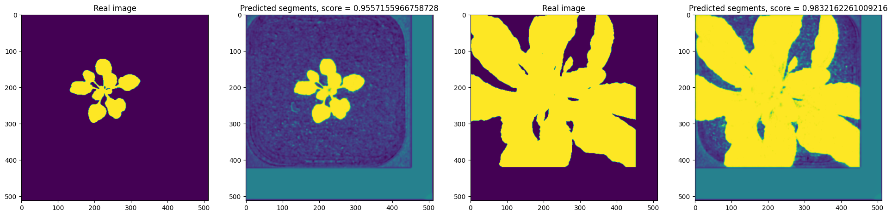
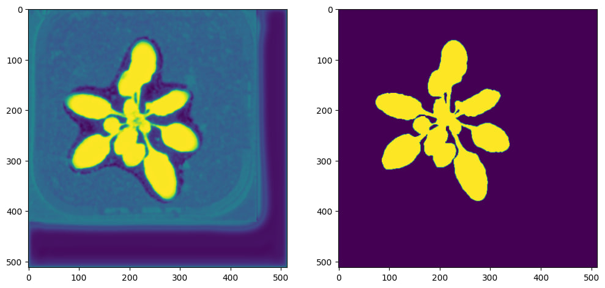
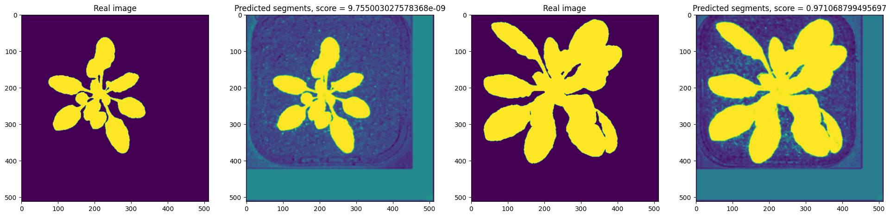

# Задача - семантическая сегментация листьев комнатных растений.

Применялась ванильная UNet с backbone - resnet18. Суммарно 6 эпох на предоставленном датасете.

Ссылка на результаты inference: в папке test_results лежат все полученные тестовые изображения.
Значения метрик:
Average DICE: 0.741266029831286
Average MSE: 1497894.6240079366
Можем наблюдать, что сеть либо переобучилась на тёмно-зелёные растения, либо недообучилась на светлые (это решится дополнительным прогоном на части со светлыми растениями, но у меня закончилось время на colab'е).

Некоторые изображения на валидации:

